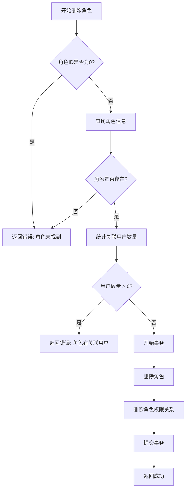

# 角色删除校验功能

## 功能说明

在删除角色之前,系统会自动检查该角色是否有关联的用户。如果有用户正在使用该角色,则禁止删除,防止数据完整性问题。

## 实现细节

### 1. 错误定义

**文件**: `common/error/errs.go`

#### 错误码
```go
ErrCodeRoleHasUsers = 10008
```

#### 错误实例
```go
ErrRoleHasUsers = NewMyError(ErrCodeRoleHasUsers, "cannot delete role with associated users")
```

### 2. Model 层

**文件**: `common/model/tadminuserrolemodel.go`

#### 新增接口方法
```go
CountByRoleId(ctx context.Context, roleId int64) (int64, error)
```

#### 实现
```go
// CountByRoleId 统计指定角色关联的用户数量
func (m *defaultTAdminUserRoleModel) CountByRoleId(ctx context.Context, roleId int64) (int64, error) {
    query := fmt.Sprintf("SELECT COUNT(*) FROM %s WHERE role_id = $1", m.table)
    var count int64
    err := m.conn.QueryRowCtx(ctx, &count, query, roleId)
    if err != nil {
        return 0, err
    }
    return count, nil
}
```

**SQL 示例**:
```sql
SELECT COUNT(*) FROM "public"."t_admin_user_role" WHERE role_id = $1
```

### 3. Logic 层

**文件**: `rpc/auth/internal/logic/adminauthservice/deleterolelogic.go`

#### 校验逻辑
```go
// 检查角色是否有关联用户
userCount, err := l.svcCtx.AdminUserRoleModel.CountByRoleId(l.ctx, in.Id)
if err != nil {
    return nil, err
}

if userCount > 0 {
    return nil, errs.ErrRoleHasUsers.GRPCStatus().Err()
}
```

## 执行流程



## 使用场景

### 场景 1: 删除没有关联用户的角色

**请求**:
```json
{
  "id": 5
}
```

**响应**: 成功删除

### 场景 2: 删除有关联用户的角色

**请求**:
```json
{
  "id": 1
}
```

**响应**:
```json
{
  "code": 10008,
  "message": "cannot delete role with associated users"
}
```

## 数据完整性保护

### 保护机制

1. **应用层校验**: 在删除前检查关联用户数量
2. **事务保护**: 删除操作在事务中执行,确保原子性
3. **级联删除**: 成功删除角色后,自动删除相关的角色权限关系

### 数据库约束

虽然应用层已经做了校验,但数据库层面也应该有相应的外键约束:

```sql
-- 如果需要,可以添加外键约束
ALTER TABLE t_admin_user_role
ADD CONSTRAINT fk_user_role_role_id
FOREIGN KEY (role_id) REFERENCES t_role(id)
ON DELETE RESTRICT;  -- 禁止删除有关联的角色
```

## 错误处理

### 错误码对照表

| 错误码 | 错误消息 | 说明 |
|--------|----------|------|
| 10004 | role not found | 角色不存在 |
| 10008 | cannot delete role with associated users | 角色有关联用户,无法删除 |

### 客户端处理建议

```javascript
// 前端处理示例
try {
  await deleteRole(roleId);
  message.success('角色删除成功');
} catch (error) {
  if (error.code === 10008) {
    message.error('该角色下还有用户,请先移除用户后再删除');
    // 可以提示用户查看关联的用户列表
    showAssociatedUsers(roleId);
  } else if (error.code === 10004) {
    message.error('角色不存在');
  } else {
    message.error('删除失败: ' + error.message);
  }
}
```

## 性能考虑

### 查询性能

`CountByRoleId` 方法使用了简单的 COUNT 查询,性能优秀:

```sql
SELECT COUNT(*) FROM "public"."t_admin_user_role" WHERE role_id = $1
```

**优化建议**:
- ✅ 已有索引: `idx_admin_user_role_role_id` (在 `init_admin.sql` 中定义)
- ✅ 查询简单,只返回计数,不返回具体数据
- ✅ 使用参数化查询,防止 SQL 注入

### 并发安全

当前实现在事务外进行校验,理论上存在以下并发问题:

**问题场景**:
1. 线程 A 检查角色 1,发现有 1 个用户
2. 线程 B 删除了角色 1 的最后一个用户
3. 线程 A 仍然返回"角色有关联用户"错误

**影响**: 这种情况下会导致误判,但不会造成数据不一致,是可以接受的。

**如果需要更严格的并发控制**,可以将校验移到事务内:

```go
err = l.svcCtx.Conn.TransactCtx(l.ctx, func(ctx context.Context, session sqlx.Session) error {
    adminUserRoleModel := l.svcCtx.AdminUserRoleModel.WithSession(session)
    
    // 在事务内检查
    userCount, err := adminUserRoleModel.CountByRoleId(ctx, in.Id)
    if err != nil {
        return err
    }
    
    if userCount > 0 {
        return errs.ErrRoleHasUsers
    }
    
    // 继续删除操作...
})
```

## 测试建议

### 单元测试

```go
func TestCountByRoleId(t *testing.T) {
    // 测试角色有用户
    count, err := model.CountByRoleId(ctx, 1)
    assert.NoError(t, err)
    assert.Greater(t, count, int64(0))
    
    // 测试角色无用户
    count, err = model.CountByRoleId(ctx, 999)
    assert.NoError(t, err)
    assert.Equal(t, int64(0), count)
}

func TestDeleteRoleWithUsers(t *testing.T) {
    // 测试删除有用户的角色
    err := logic.DeleteRole(&auth.RoleInfoReq{Id: 1})
    assert.Error(t, err)
    assert.True(t, errs.IsMyError(err, errs.ErrCodeRoleHasUsers))
}

func TestDeleteRoleWithoutUsers(t *testing.T) {
    // 测试删除无用户的角色
    err := logic.DeleteRole(&auth.RoleInfoReq{Id: 999})
    assert.NoError(t, err)
}
```

### 集成测试

1. 创建一个新角色
2. 为该角色分配用户
3. 尝试删除角色 → 应该失败
4. 移除所有用户
5. 再次尝试删除角色 → 应该成功

## 总结

### ✅ 实现的功能

1. **错误定义**: 添加了 `ErrRoleHasUsers` 错误
2. **Model 方法**: 实现了 `CountByRoleId` 统计方法
3. **业务校验**: 在删除角色前检查关联用户
4. **用户友好**: 提供清晰的错误消息

### 🔒 数据完整性保护

- 防止删除有用户的角色
- 保持用户-角色关系的一致性
- 避免孤儿数据产生

### 📊 性能优化

- 使用 COUNT 查询,性能优秀
- 利用现有索引,查询速度快
- 在删除前校验,避免无效的事务操作

这个功能确保了系统的数据完整性,防止误删除重要的角色配置! 🎉
